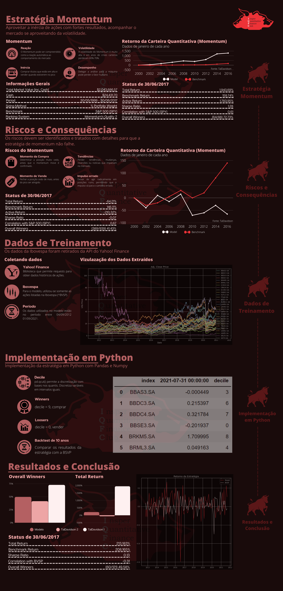

# Welcome to MkDocs of Momentum Strategy

For full documentation visit the [repository](https://github.com/EikiYamashiro/momentum_strategy).

## 💻 Requirements

Before start, check if you have met the following requirements:

<!---Estes são apenas requisitos de exemplo. Adicionar, duplicar ou remover conforme necessário--->
* `Python` (with `pandas,yfinance and matplotlib`)

## 🚀 Installing Momentum Strategy

To install Momentum Strategy, just clone the [repository here](https://github.com/EikiYamashiro/momentum_strategy)

## ☕ Using Momentum Strategy

To run the project, open the terminal in the repository folder and run:

`python ps_iqfc.py`

## 📫 Contribute to Momentum Strategy

To contribute to Momentum Strategy, follow these steps:

1. Fork this repository.
2. Create a branch: `git checkout -b <branch_name>`.
3. Make your changes and commit them: `git commit -m '<message_commit>'`
4. Push to the original branch: `git push origin <project_name> / <local>`
5. Create the pull request.

Alternatively, see the GitHub documentation at [how to create a pull request](https://help.github.com/en/github/collaborating-with-issues-and-pull-requests/creating-a-pull-request ).

## Explication

